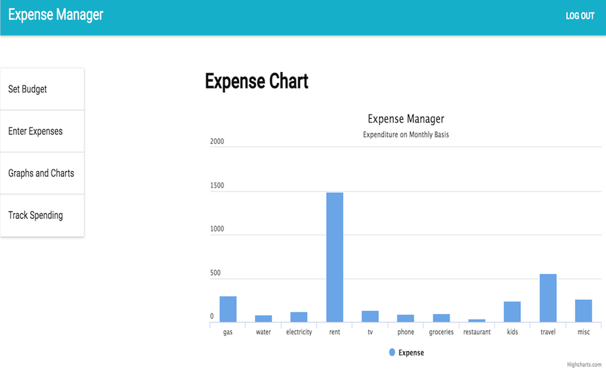

# Expense Manager

 **Live**:https://expense-manager.netlify.com
 

### About the App

Track your expenses to know where your money is going. 
Expense Manager is a complete online money management tool designed to keep track of all your expenses.

### Features

- Sign-up to be able to use the app
- Set Budget for different categories
- Enter expenses date-wise, category-wise
- Entries are recorded against budget to see what is remaining
- Graphs to visually see cash flow

### Technology Used

### Front-end
- React.js, Redux, Material UI-React, Enzyme.js, Chai, JWT authentication

### Back-end
- Node.js, Express.js, Passport.js, REST APIs, Mocha, Chai, MongoDB, Mongoose

Recurring bills such as your utilities, phone and cable can be budgeted.
Non-recurring items can also be tracked and accounted for.
Date-wise expense entry.
Ability to record entries against each budget to see how much is left.
We provide you with reports and graphs to help you understand your cash flow.